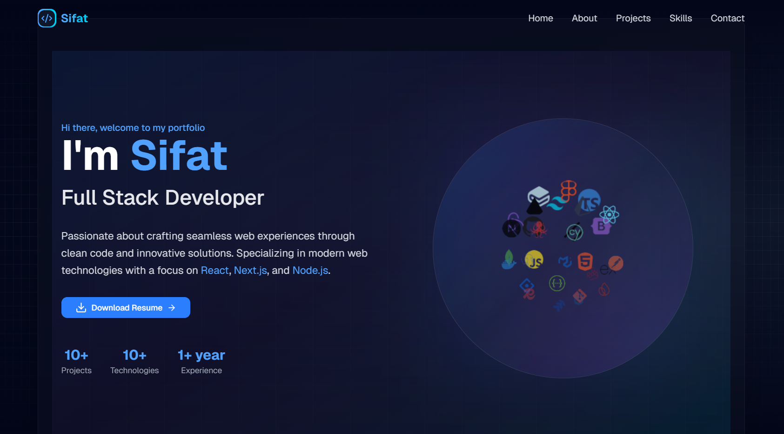

# Sifat's Portfolio

A modern, responsive portfolio website built with Next.js 14, TypeScript, and Tailwind CSS.



## 🚀 Features

- **Modern Tech Stack**: Built with Next.js 14, TypeScript, and Tailwind CSS
- **Responsive Design**: Optimized for all screen sizes
- **Interactive UI**: Smooth animations and transitions using Framer Motion
- **3D Effects**: Engaging tech stack visualization
- **Performance Optimized**: Fast loading times and optimized assets
- **Dark Mode**: Sleek dark theme design
- **SEO Friendly**: Optimized meta tags and structured data

## 🛠️ Tech Stack

- **Framework**: Next.js 14
- **Language**: TypeScript
- **Styling**: Tailwind CSS
- **UI Components**: shadcn/ui
- **Animations**: Framer Motion
- **Icons**: Lucide Icons
- **Deployment**: Vercel

## 🏃‍♂️ Running Locally

1. Clone the repository:
```bash
git clone https://github.com/SifatU360/sifat-portfolio.git
```

2. Install dependencies:
```bash
cd sifat-portfolio
npm install
```

3. Start the development server:
```bash
npm run dev
```

4. Open [http://localhost:3000](http://localhost:3000) in your browser.

## 📁 Project Structure

```
sifat-portfolio/
├── src/
│   ├── app/                 # Next.js app directory
│   ├── components/          # React components
│   ├── lib/                 # Utility functions
│   └── styles/             # Global styles
├── public/                 # Static assets
└── ...config files
```

## 🎨 Components

- **Hero**: Dynamic landing section with tech stack visualization
- **About**: Professional background and skills
- **Projects**: Showcase of recent work
- **Skills**: Technical expertise
- **Contact**: Get in touch form
- **Footer**: Social links and navigation

## 🔧 Configuration

The site can be configured by modifying:
- `src/config/site.ts` - Site metadata
- `src/config/projects.ts` - Project details
- `src/config/skills.ts` - Skills and technologies

## 📝 License

This project is licensed under the MIT License - see the [LICENSE](LICENSE) file for details.

## 🤝 Contact

Sifat Ullah - [LinkedIn](https://linkedin.com/in/yourusername) - sifatullah30.info@gmail.com

Project Link: [https://github.com/SifatU360/sifat-portfolio](https://github.com/SifatU360/sifat-portfolio)

## 🙏 Acknowledgments

- [Next.js](https://nextjs.org/)
- [Tailwind CSS](https://tailwindcss.com/)
- [shadcn/ui](https://ui.shadcn.com/)
- [Framer Motion](https://www.framer.com/motion/)